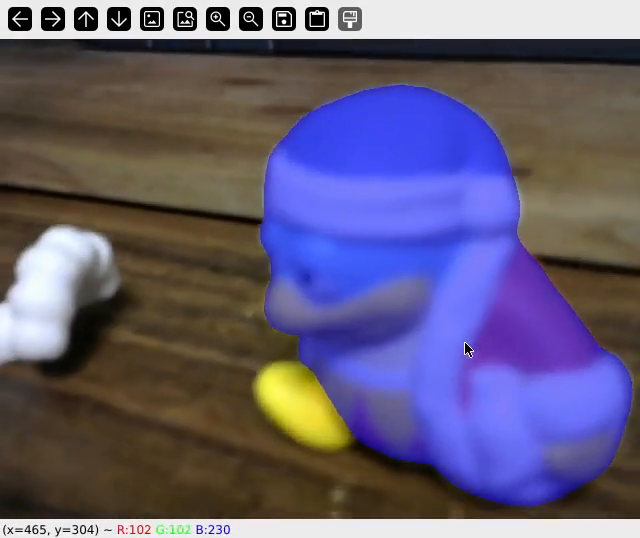

# Online [Cutie](https://github.com/hkchengrex/Cutie) Demo

<!-- <video src="./io/mobilesam_cutie_demo.m4v" controls width="600"></video> -->
[](https://youtu.be/SMoJGquCu-E)

## How to clone

```bash
git clone --recursive git@github.com:yuzoo0226/gaze_based_attention.git
```

## Environment

### Apptainer

```bash
cd apptainer
apptainer build --fakeroot --sandbox sandbox_mobilesam_cu118 mobilesam.def

apptainer shell --nv --fakeroot --writable apptainer/sandbox_mobilesam_cu118
cd your_path/gaze_based_attention/script/
python download_cutie_models.py
```

### Docker

- [TBA]

## Usage

- onnx export

```bash
cd third_party/MobileSAM
# 初回のみ実行 
python scripts/export_onnx_model.py --checkpoint ./weights/mobile_sam.pt --model-type vit_t --output ./mobile_sam.onnx
```

- webcam demo

```bash
python scripts/mobilesam_onnx.py
```
